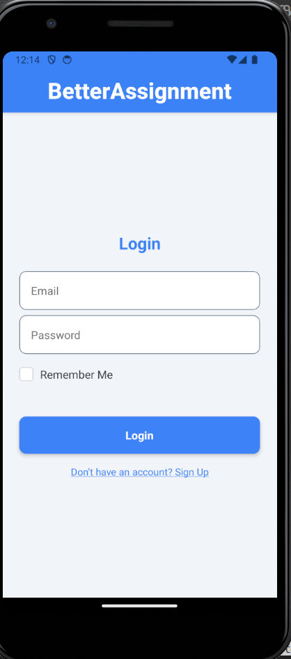
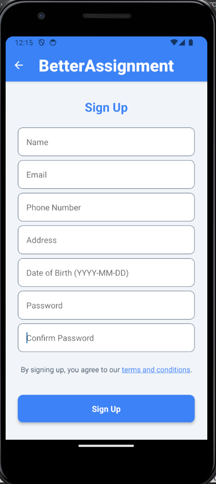
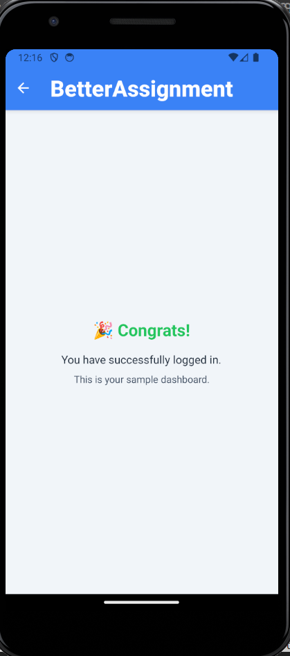

# BetterAssignment

This is a simple React Native project that demonstrates a fully functional authentication flow, including login, signup, and a sample dashboard.

---

## Table of Contents

1. [How to Run the Project](#how-to-run-the-project)
2. [Design Choices](#design-choices)
3. [Assumptions and Limitations](#assumptions-and-limitations)
4. [Screenshots](#screenshots)
5. [Future Enhancements](#future-enhancements)
6. [Feedback and Contributions](#feedback-and-contributions)

---

## How to Run the Project

### Prerequisites

- **Node.js** and **npm** installed.
- **React Native CLI** or **Expo CLI** installed.
- **Android Studio** or **Xcode** installed (for running on emulators).
- A physical device or emulator configured for testing.

### Steps to Run

1. **Clone the Repository**

   ```bash
   git clone git@github.com:CHIRAG-DID-THIS/BetterAssignment.git
   cd BetterAssignment
   ```

2. **Install Dependencies**

   ```bash
   npm install
   ```

3. **Start the Metro Bundler**

   ```bash
   npm start
   ```

4. **Run the Application**

   - For Android:

     ```bash
     npm run android
     ```

   - For iOS:

     ```bash
     npm run ios
     ```

---

## Design Choices

1. **Libraries Used:**
   - **Formik**: For form state management.
   - **Yup**: For schema-based validation.
   - **AsyncStorage**: For local storage of user data.
   - **React Navigation**: For handling navigation between screens.

2. **UI/UX Design:**
   - Clean and minimalistic design using reusable components.
   - Consistent color theme across all screens.
   - Password strength indicator for enhanced user experience during signup.
   - Accessibility features such as ARIA roles and hints for form fields.

3. **State Management:**
   - Local state (`useState`) is used for toggles like "Remember Me."
   - Navigation state is managed using React Navigation.

4. **Code Organization:**
   - **`components/`**: Contains reusable components (e.g., `CustomCheckBox`).
   - **`Styles/`**: Centralized styles for consistency.
   - **`Utils/`**: Validation schemas for clean separation of logic.

---

## Assumptions and Limitations

### Assumptions

1. The app does not include a backend. User data is stored locally using `AsyncStorage`.
2. Email validation follows standard regex patterns but does not verify if an email is real.
3. Password strength is evaluated based on:
   - Length of at least 8 characters.
   - Presence of a special character.
   - Inclusion of at least one number.

### Limitations

1. **Security:**
   - Storing user credentials in `AsyncStorage` is not secure for production apps. A secure backend should be used.
   - No encryption is applied to stored data.

2. **Scalability:**
   - The app is designed for demonstration purposes and may not handle large datasets efficiently.

3. **Device Compatibility:**
   - Tested only on Android and iOS emulators. May require adjustments for cross-platform edge cases.

---

## Screenshots

### Login Page



### Signup Page



### Dashboard



---

## Future Enhancements

1. Integrate with a backend service for secure storage and authentication.
2. Add more robust error handling and edge case scenarios.
3. Implement animations for a smoother user experience.
4. Replace `AsyncStorage` with secure storage solutions for better security.
5. Add localization for multilingual support.

---

## Feedback and Contributions

Feel free to open issues or contribute by submitting a pull request if you find areas for improvement.

---

## Author

**Chirag Garg**

---
```
